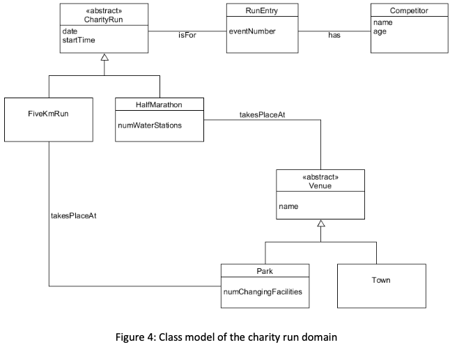
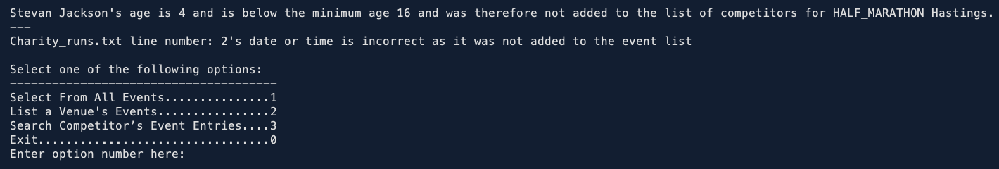
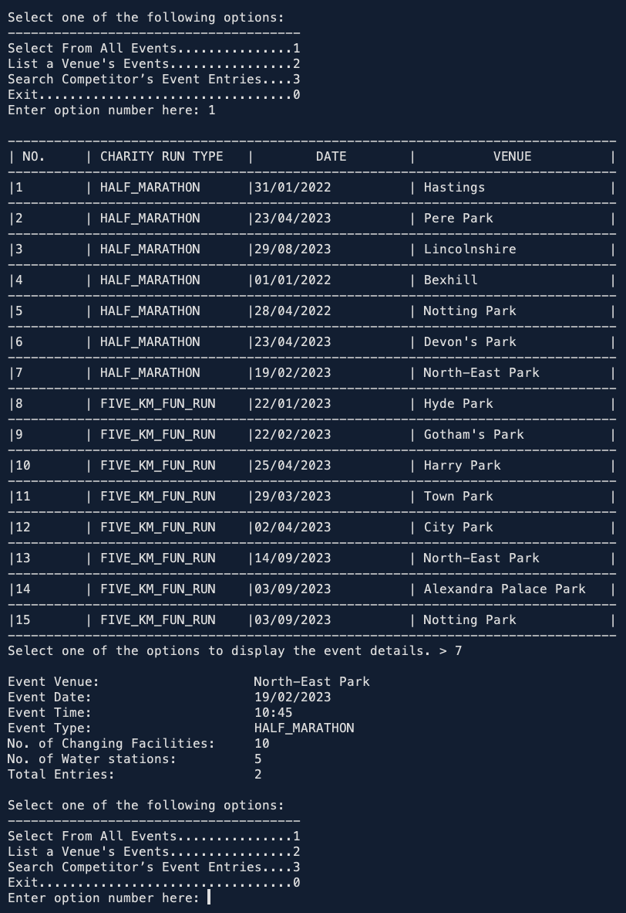
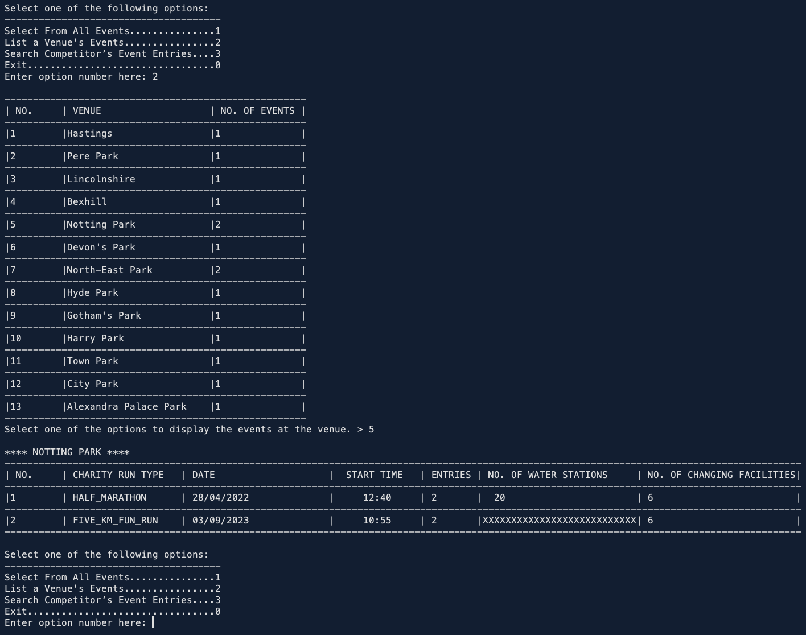
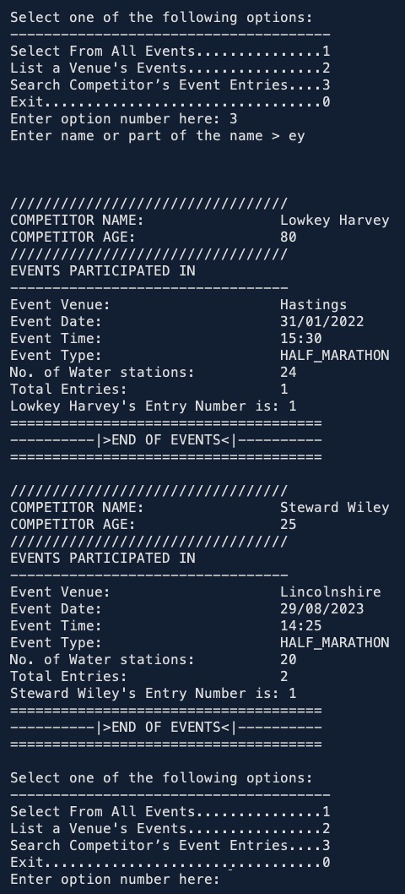

# Charity-Run-Management-System
**Object Oriented Programming Coursework, Second Year of Computer Science**

  ## Use cases
- **List Event Information**. The user of the software system identifies a running event by selecting it from a list provided by the system. Once an event is selected, the system displays the name of the event’s venue, along with the current number of entries for that event. If the event is a half- marathon, the system also displays the number of water stations along the route of the race.
-  **List Venue Details**. The user of the software system identifies a venue by selecting it from a list provided by the system. Once a venue is selected, the system displays a list of the dates and start times of each running event taking place at that venue and, in the case of a park, the number of changing facilities available there. If there are no events taking place at the venue the system informs the administrator of this fact.
- **Search Competitor’s Event Entries**. The administrator identifies a competitor by entering a name, or partial name. For all competitors that match, the system displays the competitor’s name and age. For each running event for which the competitor has an entry, the system displays the event date, along with the event number the competitor has been allocated for that event. The system also states whether the event is a 5 km fun run or a half-marathon.

Task is to design a Java 8 program for the charity running event management system described above, which provides a console-based (text I/O) user interface that facilitates the three listed use cases.

  Below is a partial UML class of the project, for which, the project includes Java classes.
  
  
 
1. Program presents the User with a console-based menu to interact with the data set. Application consists of some ‘dummy’ data pre-coded into the application. There is no requirement to insert or update any data. There is also error-handling for incorrect data.

  
  
2. The User can simply exit the program by entering zero. The three other menu options allow the User to inspect the information in the data set (note again that this program is entirely read-only and there was no requirement to add, update or delete any part of the data set).

  Below are images of the necessary interactions of the program with respect to the options mentioned above.
  
- &emsp; Select from All Events
  
  &emsp;&emsp; 

- &emsp; List a Venue's Events
  
  &emsp;&emsp; 
  
- &emsp; Search Competitor's Event Entries
  
  &emsp;&emsp; 
